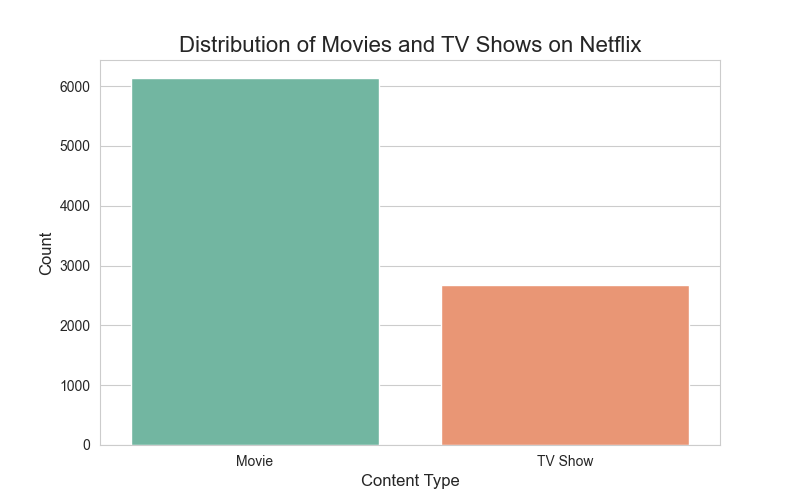
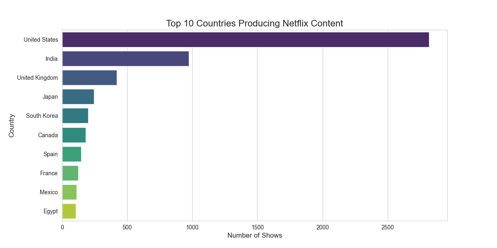
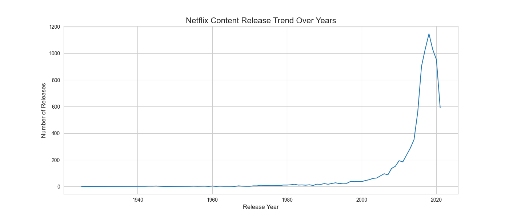
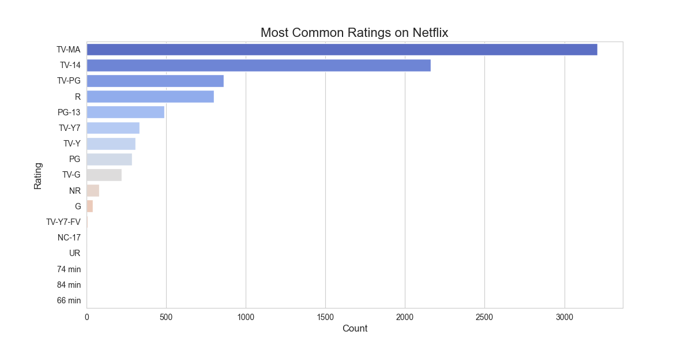
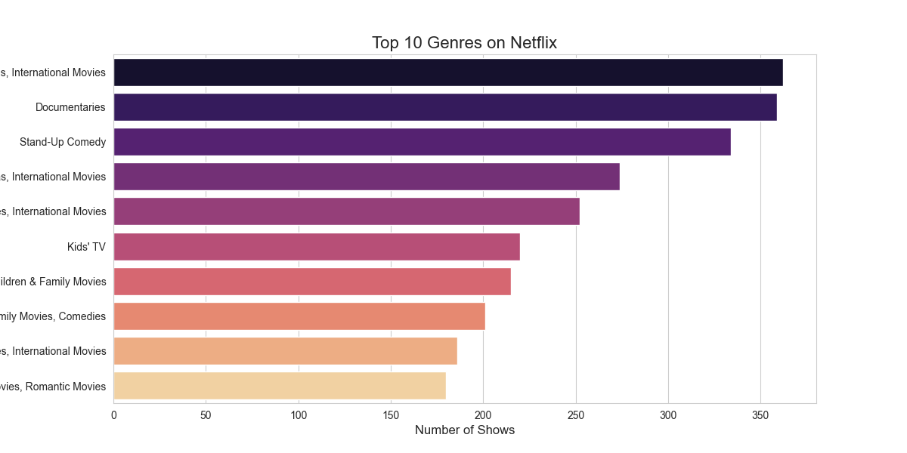
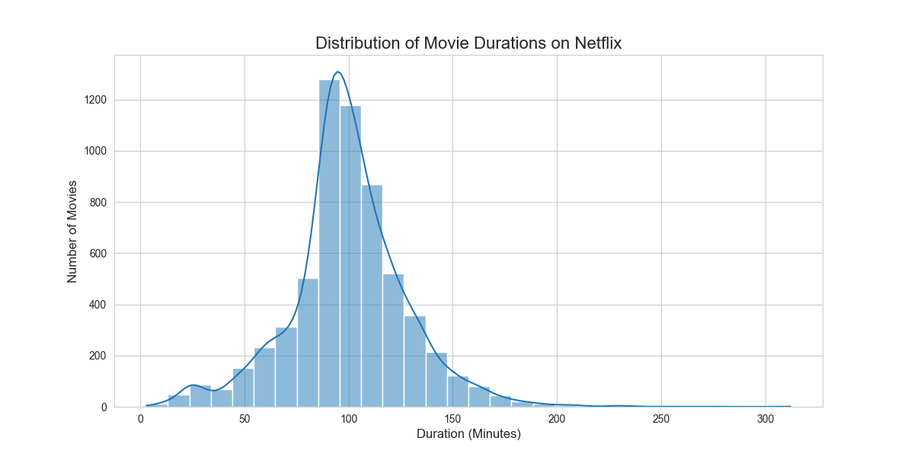

# 🎬 Netflix Exploratory Data Analysis (EDA)
-----

## 📌 Description
----

This project analyzes the Netflix Titles dataset using Python to generate meaningful insights through Exploratory Data Analysis (EDA) and data visualization. 
The dataset is used to study content distribution, release trends, ratings, genres, and movie duration patterns on Netflix.

The workflow includes data loading → cleaning → analysis → visualization → extraction of business insights.
---

# 🛠️ Technologies Used
------

| Category | Tools |
|---|---|
| Python | Programming Language |
| Pandas | Data Manipulation & Analysis |
| NumPy | Numerical Operations |
| Matplotlib | Data Visualization |
| Seaborn | Statistical Visualization |
| Jupyter Notebook | Interactive Analysis Environment |
| Git & GitHub | Version Control & Project Hosting |

---

✨ Features
---

* Data cleaning and preprocessing using Pandas
* Exploratory Data Analysis (EDA) on Netflix dataset
* Professional data visualizations using Matplotlib and Seaborn
* Analysis of Netflix content trends and distribution
* Country-wise, ratings, and genre-based analysis
* Extraction of meaningful business insights from data
---

# ▶️ Demo Video
----

▶️ Watch the project demonstration here:

---

## Repository Structure
---

```text
CodeAlpha_ExploratoryDataAnalysis
│
├── EDA_Project.ipynb                  # Main notebook (EDA + Visualizations)
├── netflix_titles.csv                 # Dataset used for analysis
├── images                             # Saved visualization outputs
│   ├── movies_vs_tvshows.png
│   ├── top_countries.png
│   ├── release_trend.png
│   ├── ratings.png
│   ├── genres.png
│   └── movie_duration.png
└── README.md                          # Project documentation
```
---

## How to Run
---

### 1️⃣ Clone the repository

```bash
git clone https://github.com/BasheerUnnisa1/CodeAlpha_ExploratoryDataAnalysis.git
```

### 2️⃣ Open the project folder

```bash
cd CodeAlpha_ExploratoryDataAnalysis
```

### 3️⃣ Install required libraries

```bash
pip install pandas numpy matplotlib seaborn notebook
```

### 4️⃣ Launch Jupyter Notebook

```bash
jupyter notebook
```

### 5️⃣ Open and run the notebook

```bash
EDA_Project.ipynb
```

---

## Output
---

* Netflix content distribution insights  
* Country-wise content analysis  
* Ratings distribution analysis  
* Genre popularity analysis  
* Movie duration trend analysis  
* Content release trend visualization 

# 📊 Visualizations

### 🎥 Movies vs TV Shows Distribution
---


### 🌍 Top 10 Countries Producing Netflix Content
---


### 📈 Netflix Content Release Trend
---


### ⭐ Most Common Ratings on Netflix
---


### 🎭 Top 10 Genres on Netflix
---


### ⏱️ Distribution of Movie Durations
---


---

## Skills Demonstrated
---

* Data Cleaning  
* Exploratory Data Analysis (EDA)  
* Data Visualization  
* Trend Analysis  
* Business Insight Generation  
* Python Programming  
* Git & GitHub Workflow  
---

## Author
---

### Shaik Basheer Unnisa  

> Python Developer | Data Analysis Enthusiast
